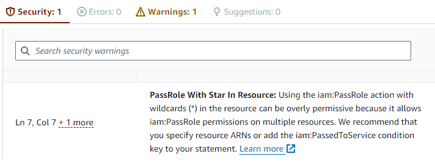

# aws-lint-iam-policies

Runs IAM policy linting and security checks against either a single AWS account or a set of member accounts of an AWS Organization. Dumps all supported identity-based and resource-based policies to a local directory and reports on those that violate security best practices or contain errors. See the accompanying blog post 
[here](https://medium.com/@michael.kirchner/linting-aws-iam-policies-e76b95859c93).

The script makes use of two mechanisms:

1. AWS IAM Access Analyzer policy validation, which is mostly known for showing recommendations when manually editing IAM policies on the AWS Console UI. The checks are created and maintained by AWS and are described closer [here](https://docs.aws.amazon.com/IAM/latest/UserGuide/access-analyzer-reference-policy-checks.html).


2. AWS IAM Access Analyzer checks for public access, which test whether resource-based policies grant unrestricted public access (e.g., to S3 buckets, SQS queues, etc.). They are described closer [here](https://docs.aws.amazon.com/IAM/latest/UserGuide/access-analyzer-custom-policy-checks.html).


## Usage

Make sure you have AWS credentials configured for your targeted environment. This can either be done using [environment 
variables](https://docs.aws.amazon.com/cli/latest/userguide/cli-configure-envvars.html) or by specifying a [named 
profile](https://docs.aws.amazon.com/cli/latest/userguide/cli-configure-files.html) in the optional `--profile` 
argument.

* If your are running the script against a single AWS account (`--scope ACCOUNT`), you require at least [these permissions](permissions/scope_account.json). 

* If you are running the script against a set of member accounts of an AWS Organization (`--scope ORGANIZATION`), you must use credentials that belong to the Organizations management account and have at least [these permissions](permissions/scope_organization.json). The Organizations member accounts need to have an IAM role configured that can be assumed from the Organizations management account. In many cases, there is the default `OrganizationAccountAccessRole` available. When assuming the role, the script will automatically drop its permissions to read-only access. If you are using a custom role instead of `OrganizationAccountAccessRole`, it requires at least [these permissions](permissions/scope_account.json). 

By default, all supported policy types and all regions are analyzed in the targeted AWS account(s). See the list of supported arguments below, in case you want to reduce coverage.

Example invocations:

```bash
pip install -r requirements.txt

python aws_lint_iam_policies.py --scope ACCOUNT

python aws_lint_iam_policies.py --scope ACCOUNT --include-policy-types s3_bucket_policies,kms_key_policies

python aws_lint_iam_policies.py --scope ORGANIZATION --member-accounts-role OrganizationAccountAccessRole

python aws_lint_iam_policies.py --scope ORGANIZATION --member-accounts-role OrganizationAccountAccessRole --exclude-accounts 112233445566,998877665544
```


## Supported arguments
```
--list-policy-types
    list all supported policy types and exit
--scope {ACCOUNT,ORGANIZATION}
    target either an individual account or all accounts of an AWS Organization
--member-accounts-role MEMBER_ACCOUNTS_ROLE
    IAM role name present in member accounts that can be assumed from the Organizations management account
--exclude-policy-types EXCLUDE_POLICY_TYPES
    do not target the specified comma-separated list of policy types
--include-policy-types INCLUDE_POLICY_TYPES
    only target the specified comma-separated list of policy types
--exclude-regions EXCLUDE_REGIONS
    do not target the specified comma-separated list of region names
--include-regions INCLUDE_REGIONS
    only target the specified comma-separated list of region names
--exclude-accounts EXCLUDE_ACCOUNTS
    do not target the specified comma-separated list of account IDs
--include-accounts INCLUDE_ACCOUNTS
    only target the specified comma-separated list of account IDs
--exclude-ous EXCLUDE_OUS
    do not target the specified comma-separated list of Organizations OU IDs
--include-ous INCLUDE_OUS
    only target the specified comma-separated list of Organizations OU IDs
--exclude-finding-issue-codes EXCLUDE_FINDING_ISSUE_CODES
    do not report the specified comma-separated list of finding issue codes
--include-finding-issue-codes INCLUDE_FINDING_ISSUE_CODES
    only report the specified comma-separated list of finding issue codes
--profile PROFILE
    named AWS profile to use
```


## Supported policy types
The following IAM policy types are analyzed:

* ACM private CA policies
* API Gateway REST API policies
* App Mesh mesh policies
* AppSync GraphQL API policies
* Backup vault policies
* CloudTrail channel policies
* CloudWatch Logs delivery destination policies
* CloudWatch Logs destination policies
* CloudWatch Logs resource policies
* CodeArtifact domain policies
* CodeArtifact repository policies
* CodeBuild build project policies
* CodeBuild report group policies
* DataZone domain policies
* DynamoDB stream policies
* DynamoDB table policies
* EC2 capacity reservation policies
* EC2 CoIP pool policies
* EC2 dedicated host policies
* EC2 Image Builder component policies
* EC2 Image Builder container recipe policies
* EC2 Image Builder image policies
* EC2 Image Builder image recipe policies
* EC2 placement group policies
* ECR private registry policies
* ECR private repository policies
* ECR public repository policies
* EFS file system policies
* Elemental MediaStore container policies
* EventBridge event bus policies
* EventBridge schema registry policies
* FSx volume policies
* Glacier vault lock policies
* Glacier vault resource policies
* Glue data catalog policies
* Glue database policies
* Glue table policies
* IAM Identity Center application policies
* IAM Identity Center permission set inline policies
* IAM group inline policies
* IAM managed policies
* IAM role inline policies
* IAM role trust policies
* IAM user inline policies
* IoT core policies
* Kinesis data stream consumer policies
* Kinesis data stream policies
* KMS key policies
* Lambda function policies
* Lambda layer policies
* Lex bot alias policies
* Lex bot policies
* License Manager license configuration policies
* Marketplace Catalog entity policies
* Migration Hub Refactor Spaces environment policies
* Network Firewall firewall policies
* Network Firewall rule group policies
* OpenSearch domain policies
* Organizations delegation policies
* Organizations service control policies
* RDS Aurora cluster policies
* Redshift serverless snapshot policies
* Rekognition custom labels project policies
* Resource Explorer view policies
* Resource Groups group policies
* Route53 Resolver firewall rule group policies
* Route53 Resolver resolver rule policies
* Route53 Resolver resolver query log config policies
* S3 access grants instance policies
* S3 access point policies
* S3 bucket policies
* S3 directory bucket policies
* S3 multi-region access point policies
* S3 object Lambda access point policies
* S3 on Outposts access point policies
* S3 on Outposts bucket policies
* SageMaker feature group catalog policies
* SageMaker feature group policies
* SageMaker hub policies
* SageMaker lineage group policies
* SageMaker model card policies
* SageMaker model package group policies
* SageMaker pipeline policies
* Secrets manager secret policies
* Security Hub product subscription policies
* SES authorization policies
* SNS topic policies
* SQS queue policies
* SSM Incident Manager contact policies
* SSM Incident Manager response plan policies
* SSM OpsCenter OpsItemGroup resource policies
* SSM Parameter Store parameter policies
* VPC endpoint policies
* VPC IPAM pool policies
* VPC IPAM resource discovery policies
* VPC prefix list policies
* VPC subnet policies
* VPC Traffic Mirroring target policies
* VPC Transit Gateway policies


## Example result file

Results are written to a JSON file. Findings are grouped once by account ID and once by finding category. This means that one specific finding is present twice in the result file.

```json
{
  "_metadata": {
    "invocation": "aws_lint_iam_policies.py --scope ACCOUNT",
    "account_id": "123456789012",
    "principal": "arn:aws:iam::123456789012:user/user1",
    "scope": "ACCOUNT",
    "run_timestamp": "20230729093927",
    "stats": {
      "number_of_policies_analyzed": 61,
      "number_of_results_collected": 2
    },
    "errors": []
  },
  "results_grouped_by_account_id": {
    "123456789012": [
      {
        "account_id": "123456789012",
        "region": "us-east-1",
        "source_service": "iam",
        "resource_type": "AWS::IAM::UserPolicy",
        "resource_name": "user1:inlinepolicy",
        "resource_arn": "arn:aws:iam::123456789012:user/user1",
        "policy_dump_file_name": "123456789012_us-east-1_AWS_IAM_UserPolicy_user1_inlinepolicy_0.json",
        "finding_type": "SECURITY_WARNING",
        "finding_issue_code": "PASS_ROLE_WITH_STAR_IN_RESOURCE",
        "finding_description": "Using the iam:PassRole action with wildcards (*) in the resource can be overly permissive because it allows iam:PassRole permissions on multiple resources. We recommend that you specify resource ARNs or add the iam:PassedToService condition key to your statement.",
        "finding_link": "https://docs.aws.amazon.com/IAM/latest/UserGuide/access-analyzer-reference-policy-checks.html#access-analyzer-reference-policy-checks-security-warning-pass-role-with-star-in-resource"
      },
      {
        "account_id": "123456789012",
        "region": "eu-central-1",
        "source_service": "sqs",
        "resource_type": "AWS::SQS::QueuePolicy",
        "resource_name": "queue1",
        "resource_arn": "arn:aws:sqs:eu-central-1:123456789012:queue1",
        "policy_dump_file_name": "123456789012_eu-central-1_AWS_SQS_QueuePolicy_queue1_0.json",
        "finding_type": "WARNING",
        "finding_issue_code": "MISSING_VERSION",
        "finding_description": "We recommend that you specify the Version element to help you with debugging permission issues.",
        "finding_link": "https://docs.aws.amazon.com/IAM/latest/UserGuide/access-analyzer-reference-policy-checks.html#access-analyzer-reference-policy-checks-general-warning-missing-version"
      }
    ]
  },
  "results_grouped_by_finding_category": {
    "SECURITY_WARNING": {
      "PASS_ROLE_WITH_STAR_IN_RESOURCE": [
        {
          "account_id": "123456789012",
          "region": "us-east-1",
          "source_service": "iam",
          "resource_type": "AWS::IAM::UserPolicy",
          "resource_name": "user1:inlinepolicy",
          "resource_arn": "arn:aws:iam::123456789012:user/user1",
          "policy_dump_file_name": "123456789012_us-east-1_AWS_IAM_UserPolicy_user1_inlinepolicy_0.json",
          "finding_type": "SECURITY_WARNING",
          "finding_issue_code": "PASS_ROLE_WITH_STAR_IN_RESOURCE",
          "finding_description": "Using the iam:PassRole action with wildcards (*) in the resource can be overly permissive because it allows iam:PassRole permissions on multiple resources. We recommend that you specify resource ARNs or add the iam:PassedToService condition key to your statement.",
          "finding_link": "https://docs.aws.amazon.com/IAM/latest/UserGuide/access-analyzer-reference-policy-checks.html#access-analyzer-reference-policy-checks-security-warning-pass-role-with-star-in-resource"
        }
      ]
    },
    "WARNING": {
      "MISSING_VERSION": [
        {
          "account_id": "123456789012",
          "region": "eu-central-1",
          "source_service": "sqs",
          "resource_type": "AWS::SQS::QueuePolicy",
          "resource_name": "queue1",
          "resource_arn": "arn:aws:sqs:eu-central-1:123456789012:queue1",
          "policy_dump_file_name": "123456789012_eu-central-1_AWS_SQS_QueuePolicy_queue1_0.json",
          "finding_type": "WARNING",
          "finding_issue_code": "MISSING_VERSION",
          "finding_description": "We recommend that you specify the Version element to help you with debugging permission issues.",
          "finding_link": "https://docs.aws.amazon.com/IAM/latest/UserGuide/access-analyzer-reference-policy-checks.html#access-analyzer-reference-policy-checks-general-warning-missing-version"
        }
      ]
    }
  }
}
```


## Notes

* To speed up execution of the script, run it within an AWS region (e.g., on EC2 or CloudShell) instead of your local machine. Network latency between AWS regions is usually lower than your machine connecting to each region via the Internet.

* The provided minimum IAM permissions exceed the policy size limit for IAM user inline policies (2048 characters). Consider using managed policies or roles instead, which have higher policy size limits.

* Analysis of a policy via AWS IAM Access Analyzer is conducted in the same AWS account and region where the policy is stored. This means that your policy information is not transferred to another region that you are not already using.

* Using a delegated administrator account for AWS Organizations is not supported.

* The script can only lint policies that are using the AWS IAM policy language. It is not capable of linting other policy languages, such as Cedar policies (as used in AWS Verified Access and AWS Verified Permissions, for example).


## Related projects

If this script does not quite fulfill your needs, consider looking at the following projects that offer similar functionality:
* https://github.com/duo-labs/parliament
* https://github.com/sjakthol/aws-access-analyzer-validator
